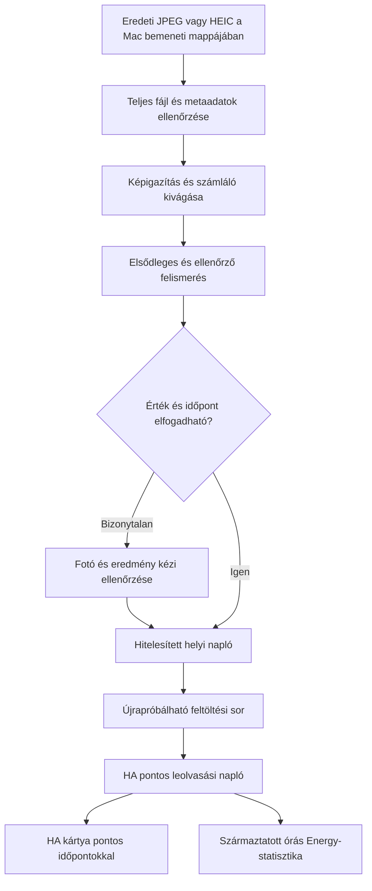

# Gázóra-fotók feldolgozása és időhelyes Home Assistant-integráció

Dátum: 2026-09-07. Állapot: a felhasználó 2026-09-07-én jóváhagyta; megvalósítás alatt.

## 1. Cél és rögzített döntés

A felhasználó eredeti telefonfotókat másol egy feldolgozó mappába. Az alkalmazás leolvassa a mechanikus gázórát, a kép metaadataiból kinyeri a készítési időt, és a jóváhagyott mérőállást ehhez az időponthoz rendelve tárolja a Home Assistantban. A feldolgozás és feltöltés ideje ettől külön mező.

A felhasználó választása: **először Macen, később otthoni szerveren**. Az első változat helyi Python-alkalmazás böngészős kezelőfelülettel; a feldolgozó mag nem függ macOS-től. Később ugyanaz a program konténerben, megosztott bemeneti mappával futtatható.

## 2. Ellenőrzött kiinduló állapot

### Meglévő projektek

- `/Users/kasnyiklaszlo/_DEV/_GAZORA_DIGITALIZALAS`: a vizsgálat kezdetén üres célmappa; ide kerül az új rendszer.
- `/Users/kasnyiklaszlo/Documents/Documents - Kasnyík MacBook Air/_DEV/_GAZORA_beolvaso`: Python, Pillow/HEIF, képelőkészítés, MiniMax-hívás, CSV, grafikus felület és REST-alapú HA-feltöltő. Használható fotógyűjtemény és korábbi hibapéldák.
- `/Users/kasnyiklaszlo/Documents/Documents - Kasnyík MacBook Air/_DEV/HomeAssistant-Energy-Import`: CSV/TSV-konverzió és külön IMPORT_DATA segédtábla-import. A `convert_google_sheets.py` készít tényleges HA-statisztikaimporthoz TSV-t.
- `/Users/kasnyiklaszlo/_DEV/_HOME_ASSISTANT_AI`: a HA konfigurációja és kapcsolati beállításai. Meglévő, más munkához tartozó módosításokat tartalmaz; a vizsgálat nem módosította.

### Élő HA: csak olvasással ellenőrizve

- Core: **2026.7.2**; időzóna: **Europe/Budapest**.
- Telepítve: `recorder`, `import_statistics`, `llmvision`, `mqtt`.
- Elérhető: `import_statistics.import_from_json`, `import_from_file`, `export_statistics`, `export_inventory`.
- Az Energy gázforrásai: `sensor:gas_meter_reading_diff_old` és `sensor:gas_meter_reading_diff_new`.
- Ezek külső statisztikaazonosítók; a kettőspont jelentéssel bír. Nem azonosak a ponttal írt szenzorentitásokkal.
- `sensor.gas_meter_reading_diff` létezik, `total_increasing`, `gas`, `m³`; a vizsgálatkor 277.256. Ezt nem tekintjük igazolt, friss fizikai mérőállásnak.
- Az új külső sor metadata mezőjében `unit_class: null` szerepel. A céladatoknál explicit `volume` szükséges; átállítás előtt kompatibilitási vizsgálat.
- Nem történt állapotfrissítés, statisztikaimport, konfigurációmódosítás vagy újraindítás.

### Valódi képek és metaadatok

A `_FELDOLGOZOTT` mappában 101 JPEG/HEIC fájl található. 94 helyben rendelkezésre álló fájl EXIF-adatait ellenőriztem; 7 felhőben tárolt, helyben tartalom nélküli fájlt kihagytam. Ez metaadat-vizsgálat, nem 94 kép OCR-pontosságtesztje.

| Telefon az EXIF szerint | Ellenőrzött képek | Példa | Eredeti készítési idő |
| --- | ---: | --- | --- |
| Xiaomi 15T Pro | 6 | IMG_20260318_224340.jpg | 2026-03-18T22:43:42.865+01:00 |
| iPhone 14 Pro Max | 88 | IMG_3805.HEIC | 2026-03-03T05:53:16.582+01:00 |

Mind a 94 vizsgált fájlban jelen volt a `DateTimeOriginal`, `OffsetTimeOriginal` és `SubSecTimeOriginal`. A példákban a készítési idő az EXIF al-IFD-ben található, nem a felső szinten. A felhasználó pontosítása szerint a támogatandó készülékek: Xiaomi 15T Pro és iPhone 14 Pro Max; a korábbi 13/14T megjelölés elírás volt.

A megtekintett `cropped_test.jpg` mechanikus, öt egész és három tizedes számjegyes mérőt mutat. Az elforgatás, a gördülő számjegyek és a közeli gyári szám egyaránt releváns felismerési nehézség.

## 3. Miért nem elég a régi megoldás?

1. A `ha_inserter.py` a `/api/states/...` végpontot hívja. A fotó dátumát `attributes.datetime` mezőbe teszi. Ez nem hoz létre visszadátumozott Recorder-állapotot.
2. A `leolvaso.py:get_image_date` felső szintű EXIF-ben keresi az eredeti dátumot, majd módosítási dátumot használhat; nem kezeli az időzónaeltolást és a másodperctörtet. Egyes hibautakon fájlmódosítási időre esik vissza, máskor üres eredményt ad, amelyet a rendező szintén fájlidővel helyettesít.
3. A `csv_transformer.py:parse_datetime` értelmezhetetlen dátumnál `datetime.now()` értéket ad. Pontos történeti importnál ez tiltandó.
4. Ugyanez a transzformáló a csökkenő mérőállást automatikusan óracserének minősítheti. OCR-hibából így hamis fogyasztás keletkezhet.
5. Az Energy-konvertáló egész órára vágja az időpontokat, és `state = sum = mérőállás` értéket ír. Ez választott origóval működhet, de meglévő sor folytatásánál az origót és az óracserét külön kell egyeztetni; nem általános fogyasztásszámítás.
6. A korábbi AI-validáció trendből javasol számjegyjavításokat, és a változatlan mérőállást is hibának minősíti. A jelentés nem hiteles referenciaadat.

## 4. A pontos idő és az Energy korlátja

A HA 2026.7.2 forráskódja a történeti statisztikaimportnál időzónás, egész órára eső `start` értéket követel. Nem fogad el például `22:43:42.865` időpontot. A hosszú távú statisztika órás felbontású. [HA statisztika-forráskód](https://github.com/home-assistant/core/blob/2026.7.2/homeassistant/components/recorder/statistics.py#L2606), [statisztikai adatmodell](https://data.home-assistant.io/docs/statistics/).

Ezért két külön, összekapcsolt adatsort kell kezelni:

- **Pontos leolvasási napló a HA-ban:** minden mérőállás eredeti, időzónás fotóidővel, akár ezredmásodperccel. Saját integráció tartós tárolója és lekérdezhető történeti nézete. A Mac kikapcsolása után is elérhető.
- **Energy-statisztika:** ebből származtatott órás sor a HA Recorder hivatalos statisztikai felületén keresztül. Az órás időbélyeg egy időablakot jelöl, nem írja át az eredeti fotóidőt.

A szokásos szenzor History görbe nem lesz ettől másodpercre visszadátumozott. A pontos történet külön HA-kártyán jelenik meg. Ez a terv lényegi, jóváhagyandó termékdöntése.

Két fotó alapján a két időpont közötti összfogyasztás ismert. A köztes órák vagy napok tényleges fogyasztása nem rekonstruálható biztosan.

**Javasolt első változat:** a változás a későbbi leolvasás órájában jelenik meg, a felület egyértelműen leolvasásalapú elszámolásként jelöli. Több nap kihagyásakor ez nem valós napi fogyasztási profil. Automatikus lineáris szétosztás nincs. Későbbi opcionális interpoláció kizárólag becslésként, külön sorban engedhető meg.

## 5. Megvizsgált megoldások és választás

| Megközelítés | Hasznos elem | Illeszkedés ehhez a feladathoz |
| --- | --- | --- |
| [AI-on-the-edge-device](https://github.com/jomjol/AI-on-the-edge-device) | Számjegyrégiók, képigazítás, gördülő számjegyek ellenőrzése | Dedikált ESP32-CAM-os mérésre készült. Algoritmikus minta, nem kész telefonfotó-importáló. |
| [Cian911/smart-gas-meter](https://github.com/Cian911/smart-gas-meter) | YOLO számjegyfelismerés, plausibilitási ellenőrzés | A dokumentáció hét szegmenses LCD-re tanított modellt ír le; a saját mechanikus mérőn külön validálás/tanítás kellene. |
| [esp32-meter-reader](https://github.com/dcelasun/esp32-meter-reader) | Külön képfogadó szolgáltatás, PaddleOCR, MQTT | A feldolgozó és HA-kapcsolat szétválasztása hasznos. A dokumentált frissítés nem oldja meg az EXIF szerinti történeti tárolást. |
| [LLM Vision](https://github.com/valentinfrlch/ha-llmvision) | Képekből adatkinyerés, HA-integráció | Már telepítve van. Felismerő komponensként vizsgálható, de önmagában nem a pontos történeti napló megoldása. |
| [homeassistant-statistics](https://github.com/klausj1/homeassistant-statistics) | CSV/JSON történeti import és export | Már használatban van. Órás import, visszaellenőrzés és migráció kiindulópontja. |

A közösségi [történeti importbeszélgetés](https://community.home-assistant.io/t/import-old-energy-readings-for-use-in-energy-dashboard/341406?page=4) is tárgyalja a kumulált érték és a későbbi fogyasztási ugrások problémáját. A technikai döntéseket a HA és az érintett projektek forrásával ellenőriztem; régi fórumos kódrészleteket nem tekintünk mai API-szerződésnek.

Három reális irány:

1. **Mac-feldolgozó + kis HA-fogadó integráció — javasolt.** Megőrzi az összes pontos leolvasást a HA-ban; ellenőrizhető, újrafuttatható, szerverre költöztethető.
2. **Mac-feldolgozó + meglévő statisztikaimportáló.** Gyorsabb, de a HA-ban csak órás adatok lennének; a pontos napló a Macen maradna. Nem teljesíti maradéktalanul a kért HA-beli pontos tárolást.
3. **Fix kamera / impulzusszámláló.** Gyakoribb mérésekből jobb napi profil, de más felhasználói munkafolyamat és hardverigény. Nem az első változat célja.

## 6. Javasolt adatfolyam

### Fogadás és tárolás

- Bemeneti mappa induláskori és időszakos átvizsgálása; opcionális fájlesemény-figyelés. Alvás vagy kiesés után is megtalálja a kimaradt képeket.
- Csak befejezett másolás és sikeres fájlolvasás után feldolgozás. Felhős helykitöltő: várakozó állapot, nem hiba és nem „feldolgozott”.
- Eredeti kép változatlan archiválása; SHA-256 tartalomazonosító; SQLite helyi napló; feldolgozás előtti és utáni fájlstabilitás-ellenőrzés.
- Állapotok: beérkezett, időpont-ellenőrzésre vár, felismerésre vár, kézi ellenőrzésre vár, elfogadott, HA-szinkronra vár, szinkronizált, visszautasított.
- Azonos fájl ismételt bemásolása nem dupláz. Külön fotó azonos mérőállással érvényes megfigyelés lehet. Azonos mérő és időpont eltérő értékkel konfliktus.

### Időpont

- Elsődleges kinyerés: ExifTool, eredeti fájlból, képkonverzió előtt; `DateTimeOriginal` + `OffsetTimeOriginal` + opcionális `SubSecTimeOriginal`. [ExifTool összetett időmező dokumentáció](https://exiftool.org/TagNames.pdf).
- Tárolás: nyers EXIF mezők, eredeti ISO-időpont, UTC-időpont, időforrás, megállapított pontosság, feldolgozási idő.
- Hiányzó időzóna esetén a helyhez rendelt `Europe/Budapest` csak dokumentált és jóváhagyott szabályként alkalmazható. Óraátállításkor kétértelmű vagy nem létező helyi idő: kézi ellenőrzés.
- Hiányzó vagy ellentmondó készítési idő: nincs automatikus import. Fájlnév, fájlmódosítási idő és mai dátum nem csendes helyettesítő.
- A telefon hibás óráját nem lehet a fotóból biztosan kijavítani. Kézi korrekció külön feljegyzéssel őrzi az eredeti értéket.

### Felismerés és hitelesítés

- JPEG/HEIC és EXIF-orientáció; teljes kép megtartása, számlálóablak kivágása eredeti felbontásból.
- Felismerő adapterek: helyi OCR és külön ellenőrző vision modell. A konkrét modell a saját, ember által címkézett fotók eredménye alapján választható ki.
- Első vizsgálati jelölt: PaddleOCR; összevetés egy megfelelő vision API-val, ha rendelkezésre áll az alkalmazáshoz használható API-hozzáférés. Új előfizetés vagy modellpontosság nincs előre feltételezve.
- Kimenet: egész számjegyek, tizedes számjegyek, bizonytalan pozíciók, kivágás koordinátái. A m³-értéket determinisztikus kód állítja elő, nem szabad szöveg értelmezése.
- `Decimal` vagy egész liter alapú számolás, tárolt eredeti számjegysorral. A vezető nullák megmaradnak.
- Az LLM saját „95%” állítása nem kalibrált megbízhatóság. Két olvasás egyezése sem garancia, különösen ugyanazzal a modellel.
- Automatikus elfogadás csak előzetesen kimért szabályrendszerrel: egyező felismerések, megfelelő kivágás, helyes számjegyszám, hiteles időpont, ismert mérő, időarányos fogyasztási korlát és szomszédos elfogadott adatokkal való összhang.
- Régebbi kép utólagos importjánál az előző és a következő időbeli szomszéd is ellenőrizendő.
- Nulla fogyasztás elfogadható. Csökkenés, átfordulás, óracsere, félállás vagy nagyságrendi ugrás nem automatikus javítás; felülvizsgálat.
- A fogyasztási korlát mérőprofilhoz kötött, időtartam- és felbontásfüggő. A trend szűrő, nem hiányzó számjegyek forrása.
- Kezdetben minden eredmény felülvizsgálható; automatikus üzem csak az elkülönített értékelő készlet után kapcsolható be. Nincs 100%-os felismerési ígéret.

### HA-fogadó és történeti nézet

- Kis egyedi integráció hitelesített, kötegelt fogadással, tartós pontos naplóval és lapozható, időtartományos lekérdezéssel.
- Mac oldali tartós kiküldési sor és HA oldali idempotenciakulcs. Hálózati hiba vagy bizonytalan válasz után ugyanaz a küldés biztonságosan megismételhető.
- Minden leolvasás: mérőazonosító, fotóazonosító, pontos idő, m³-érték, eredet, ellenőrzési állapot, revízió. Javítások megőrzött előzménnyel.
- A HA napló a fogadó integráció saját tartós tárában él; nincs közvetlen írás a Recorder `states` tábláiba.
- HA-kártya: pontos leolvasási táblázat/grafikon, időzóna, mérőállás és két mérés közötti változás. Az órás statisztika külön megnevezést kap.
- Legfrissebb mérőállás és utolsó fotóidő külön szenzorként is megjeleníthető. Régi kép betöltése nem írja vissza a legfrissebb mérőállást.
- Az összes pontos rekord ne növekvő szenzorattribútumként tárolódjon; a History-állapotok és az archív napló életciklusa különböző.
- A Mac titkai környezeti konfigurációban/Keychainben; a HA token nem kerül böngészős klienskódba. Távoli OCR csak a kivágást kapja, metaadatok nélkül.

## 7. Energy-adatok és meglévő adatok átvezetése

- Egy tulajdonosa legyen az órás sor képzésének: a HA-fogadó. A Mac és a régi alkalmazás ne írjon ugyanabba a célstatisztikába.
- A fogadó a `async_add_external_statistics` felületet használja, explicit `mean_type`, `has_sum`, `unit_class: volume`, `unit_of_measurement: m³` mezőkkel. A meglévő importáló migrációs/ellenőrző eszköz maradhat.
- UTC szerinti órás ablakon belül a legutolsó hitelesített megfigyelés a képviselő. Több eredeti leolvasás továbbra is külön megmarad a pontos naplóban.
- `state` az órás megfigyelési érték; `sum` egységes origóhoz tartozó kumulált fogyasztás. Az első mérés új sornál baseline, nem elfogyasztott mennyiség.
- Korábbi leolvasás beszúrásakor vagy javításakor az érintett órák és szükség szerint későbbi kumulált összegek újraszámítása determinisztikus. Az eredeti fotóidő sosem módosul.
- Aktuális, még nem lezárt óra később publikálható; addig a pontos leolvasás már látható.
- A küldés elfogadása nem bizonyítja a Recorder-írás befejezését: visszaolvasás ellenőrzi az órát, állapotot és összeget.
- Elsőként új, külön statisztikasorban és külön kártyán történik próba. Az Energy meglévő két forrása mellé átfedő új sor nem kapcsolható be, mert dupla fogyasztást okozna.
- Éles átvezetés előtt: meglévő két sor célzott exportja, utolsó érvényes értékek és origó ellenőrzése, óracserehatár validálása, átfedések összehasonlítása.
- Javasolt átvezetés: a mostani mérő hitelesített régi órás adatait az új sorba átemelni, azonos origóval folytatni, majd az Energy-ben a régi „new” forrást az újra cserélni. Az „old” forrás csak nem átfedő időszakkal marad. A régi sor megmarad visszaállításhoz.
- A régi órás adatokból nem készítünk hamis másodpercpontos leolvasásokat: `legacy_hourly` eredettel külön maradnak.
- Ha a meglévő adatok hibásak vagy az origó nem bizonyítható, a migráció megáll; a fotófeldolgozás és a pontos napló ettől még használható.

## 8. Megvalósítási ütemek és átadási feltételek

1. **Bemenet és időpont:** helyi projekt, függőségek, mappaválasztás, változatlan archívum, metaadatkinyerés, SQLite és próbafeldolgozás. Eredmény: fotó → ellenőrizhető időbélyeg és napló, HA-írás nélkül.
2. **Felismerés összehasonlítása:** emberileg címkézett képek mindkét céltelefonról; normál, ferde, csillogó és gördülő számjegyes esetek; egymáshoz közeli fotók ugyanabba a tanítási/értékelési csoportba. Mérőszám: teljes leolvasás helyessége, téves automatikus elfogadás, felülvizsgálati arány, idő és költség.
3. **Helyi alkalmazás:** feldolgozó sor, böngészős fotó/eredmény összevetés, javítás/elfogadás, hibákból visszaállás, szinkronállapot. Egy indítható Mac-parancs és rövid használati útmutató.
4. **HA-integráció:** pontos napló, hitelesített fogadás, történeti kártya, órás próbasor és visszaolvasás. Tesztadat csak elkülönített célba.
5. **Éles átvétel:** két telefon eredeti képeivel végigpróba, régi adatok exportja és migrációs összehasonlítása, Energy-forrás átvezetése, visszaállítási leírás.
6. **Szerverre költözés:** az elfogadott első változat után konténer, tartós adatkönyvtár és megosztott bemenet; a helyi adatbázis és archívum együtt migrálható.

Kötelező ellenőrzési esetek:

- Később bemásolt fotó ugyanazt a készítési időt adja; EXIF al-IFD, nyári/téli offset, másodperctört megmarad.
- Hiányzó/hibás időpont, óraátállítási kétértelműség és jövőbeli dátum nem okoz csendes importot.
- HEIC elforgatás nem fordul kétszer; részleges másolás és felhős helykitöltő nem kerül feldolgozott állapotba.
- Duplikált fájl, azonos mérőállás külön időpontokban, azonos órában több fotó, késve érkező régi kép.
- Vezető nulla, tizedesvessző, gördülő dob, hibás számjegy, mérőcsere és valódi nulla fogyasztás.
- HA kiesés, kliensújraindítás és elveszett válasz után sincs duplikált import.
- Egy mesterséges 10 m³-es növekedésből pontosan 10 m³ lesz; az első baseline nem fogyasztás; javítás után sem lesz duplázás.
- A HA pontos naplója a Mac leállítása után is olvasható; az Energy órás értékei egyeznek az előnézettel.

## 9. Mi van kész, és mi nincs?

Kész: meglévő kód vizsgálata, élő HA olvasási ellenőrzése, 94 fotó metaadat-ellenőrzése, projekt- és fórumkutatás, ez a tervjavaslat.

Nincs kész: új alkalmazás, OCR-összehasonlító mérés, hiteles referencia-leolvasások, HA-fogadó integráció, új történeti adatbevitel és éles átvezetés.

Jóváhagyandó irány: Mac-feldolgozó + pontos HA-napló/kártya + külön órás Energy-adatsor; bizonytalan eredmények felülvizsgálata; köztes napi fogyasztás kitalálása nélkül.

## 10. Megvalósítási állapot

Az irány megvalósult a `gasphoto/` helyi alkalmazásban és a `custom_components/gas_photo/` Home Assistant-fogadóban. A fejlesztési tesztek és izolált Recorder-ellenőrzés sikeresek; a saját HA-példányba telepítés, a két támogatott telefon eredeti képeivel végzett elfogadási próba és a régi Energy-források esetleges átvezetése külön éles lépés marad.
